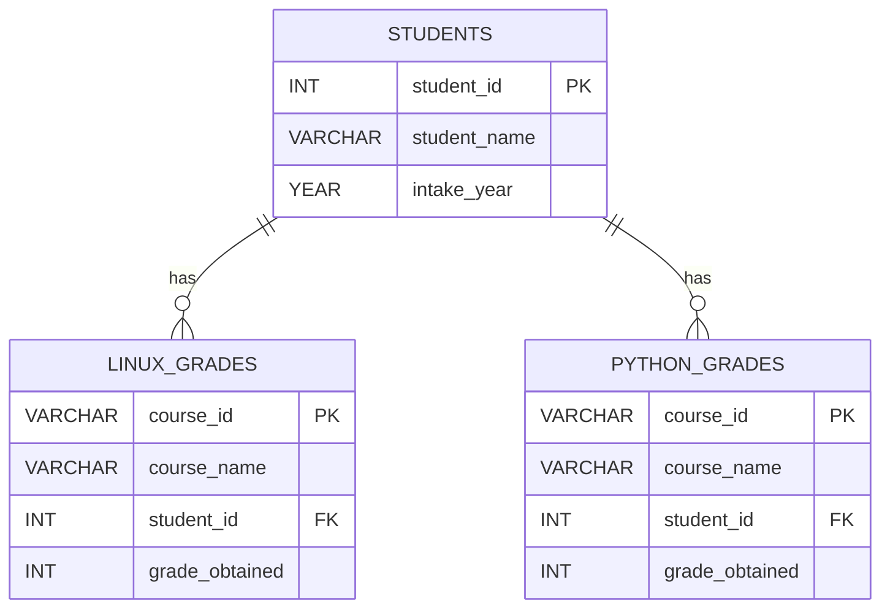

# 🎓 ALU Student Performance Database

This project is a MySQL database designed to track and analyze student performance at **ALU Rwanda**.  
It focuses on two main courses offered to trimester 2 students: **Linux** and **Python**.

---

## 📌 Database Overview

The database contains **three tables**:

1. **students**  
   - Stores student details such as ID, name, and intake year.

2. **linux_grades**  
   - Stores Linux course grades for each student.  
   - `course_id` is fixed (`Lin2025-01`).  
   - Each student can only have **one Linux grade**.

3. **python_grades**  
   - Stores Python course grades for each student.  
   - `course_id` is fixed (`Pyt2025-01`).  
   - Each student can only have **one Python grade**.

---

## ⚙️ Setup Instructions

1. Open MySQL and create the database:
   ```sql
   CREATE DATABASE ALU_student_performance_DB;
   USE ALU_student_performance_DB;
   ```

2. Run the provided SQL script to:
   - Create the tables
   - Insert sample student data
   - Insert grades for Linux and Python courses

3. Verify the data:
   ```sql
   SELECT * FROM students;
   SELECT * FROM linux_grades;
   SELECT * FROM python_grades;
   ```

---

## 📊 Sample Queries

The script includes example queries for analysis:

1. **View all students and their grades**
   ```sql
   SELECT * FROM students;
   SELECT * FROM linux_grades;
   SELECT * FROM python_grades;
   ```

2. **Find students who scored less than 50% in Linux**
   ```sql
   SELECT s.student_id, s.student_name, l.course_name, l.grade_obtained
   FROM students s
   JOIN linux_grades l ON s.student_id = l.student_id
   WHERE l.grade_obtained < 50;
   ```

3. **Find students who took only one course (Linux or Python, not both)**

4. **Find students who took both courses**

5. **Calculate the average grade in Linux and Python side by side**

6. **Find the top student across both courses based on average grade**

---

## 🗂 Schema Diagram (ERD)



---

## ✅ Features

- Enforces **data integrity** using primary keys and foreign keys.  
- Prevents duplicate grades for the same student in the same course.  
- Implements all **CHECK CONSTRAINTS** to limit the user. 

---

## 👩‍💻 Example Use Case

This database can be used by ALU staff to:
- Track academic performance of students
- Identify struggling students early (e.g., Linux scores < 50%)
- Compare performance between different courses
- Reward top-performing students

---

## 📌 Author
**ALU Student Performance DB – SQL Design & Queries**  
Python class Group 20
